# HoloLens1 MQTT Simple Sample

こちらはHoloLens1でシンプルなMQTT通信を試せるソースです。

## ベースの環境

制作者の環境なので、HoloLensのビルドおよび転送テストが出来て動作チェックが可能な環境で以下を想定しています。

* Unity 1.5f1
* Visual Studio 2017 (15.9.4)

とはいうものの、シンプルなソースなので、他の組み合わせであってもHoloLensのビルドおよび転送テストが出来て動作チェックが可能な環境であれば可能かもしれません。

## MQTTブローカの準備

自前のMQTTブローカで用意するか、以下のMQTTブローカのサービスでMQTTブローカ取得して準備しましょう。

* [shiftr.io](https://shiftr.io/)

## Getting Start

まず、リポジトリをクローンします。

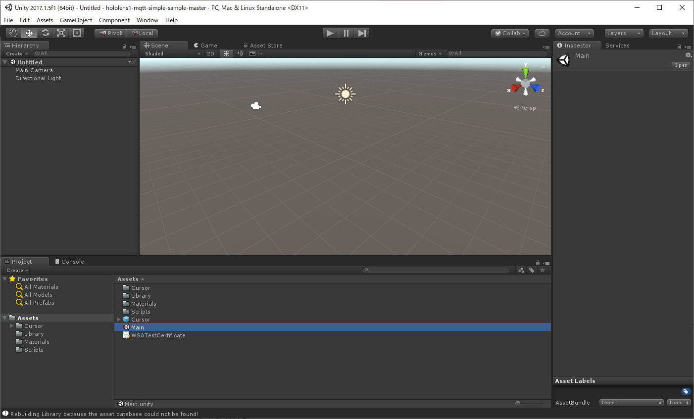

Unityで開きます。

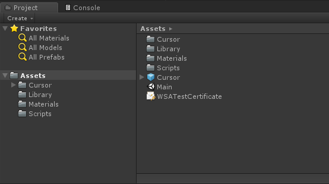

Main.unity シーンを開きます。

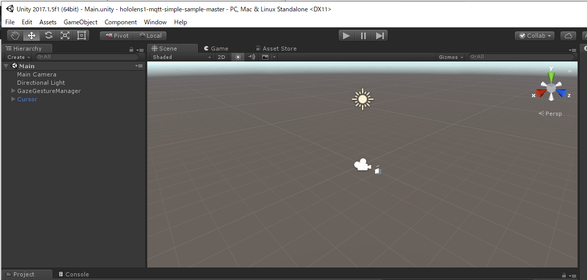

Main.unity シーンです。

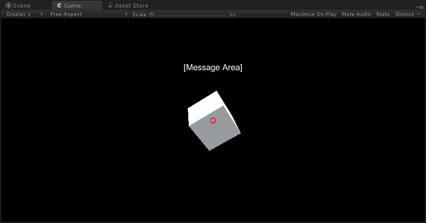

一度再生させて確認します。

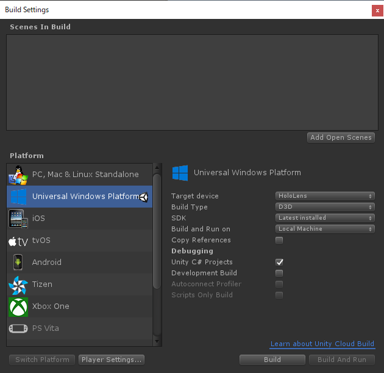

Build Settings はこのような設定で進めます。

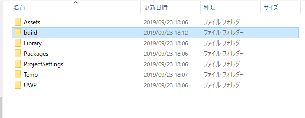

buildフォルダを作成しビルド先にします。ビルドを待ちます。

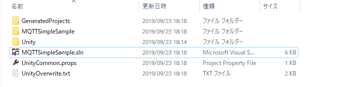

ビルドが終わったらbuildフォルダを確認します。MQTTSimpleSample.slnファイルをVisual Studioで開きます。

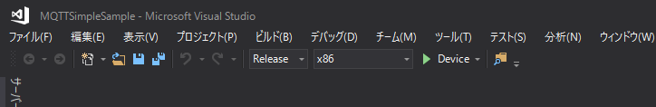

ビルド設定を、Release x86 Device にします。この設定はUSBでつないで有線で書き出すやり方です。

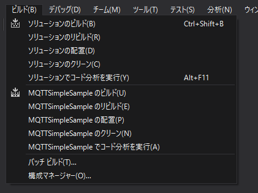

[メニュー] > [ビルド] > [ソリューションのリビルド] を行います。

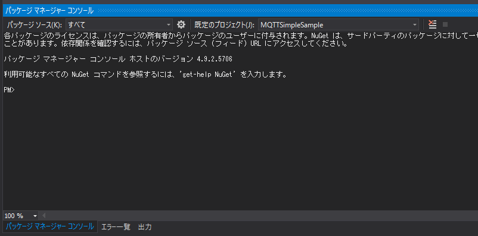

パッケージマネージャーコンソールを表示します。

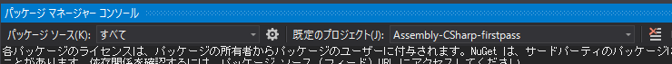

既定のプロジェクトを Assembly-CSharp-firstpass にします。

```
Install-Package M2Mqtt
```

このコマンドを実行して M2Mqtt をインストールします。

## CubeAction.cs をMQTTブローカーに合わせて編集

MQTTブローカに合わせた設定をします。MQTTの設定は CubeAction.cs で行っています。

```
// 接続先のアドレス
mqttBrokerAddress = "<BrokerAddress>";

// MQTTブローカー接続時のUserName
mqttUserName = "mqttUserName";
// MQTTブローカー接続時のmqttPassword
mqttPassword = "mqttPassword";
```

例えば shiftr.io の場合は、自分のアカウントでMQTTブローカを作った場合、

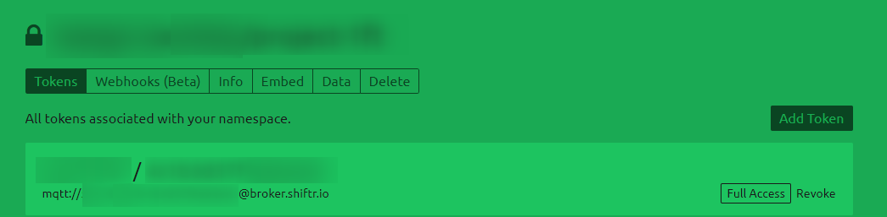

* 接続先のアドレス
    * broker.shiftr.io
* MQTTブローカー接続時のUserName
    * 設定したKey (Username)
* MQTTブローカー接続時のPassword
    * 設定したSecret (Password)

です。

shiftr.ioの公開MQTTブローカの場合は、

* 接続先のアドレス
    * broker.shiftr.io
* MQTTブローカー接続時のUserName
    * try
* MQTTブローカー接続時のPassword
    * try

です。

CubeAction.csを修正して保存し、デバイスにビルドして動かしてみましょう！

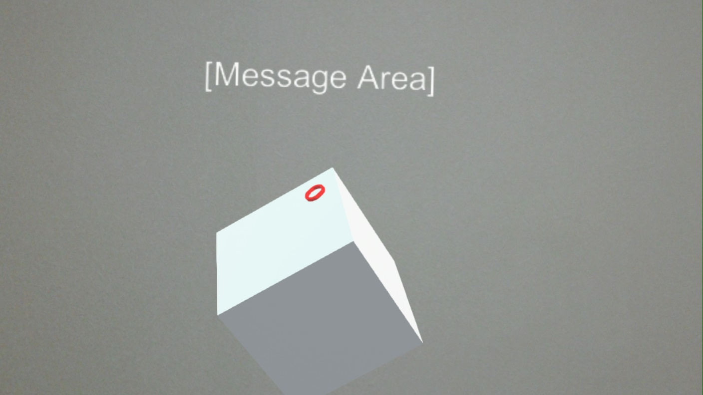

以下のように動きます。

* HoloLens側アプリ起動時にトピック ```pub/HoloLens``` でデータ ```{"status":"connected","message":"HoloLens connected!!!"}``` を送る
* HoloLens側でCubeをタップしたときにトピック ```pub/HoloLens``` でデータ ```{"status":"selected","message":"Cube selected!!!"}``` を送る
* MQTTブローカからトピック ```sub/HololLens``` に ```{"message":"Hello HoloLens!"}``` といったmessageデータが来るとHoloLens側でCube上のテキストエリアにメッセージが表示されます

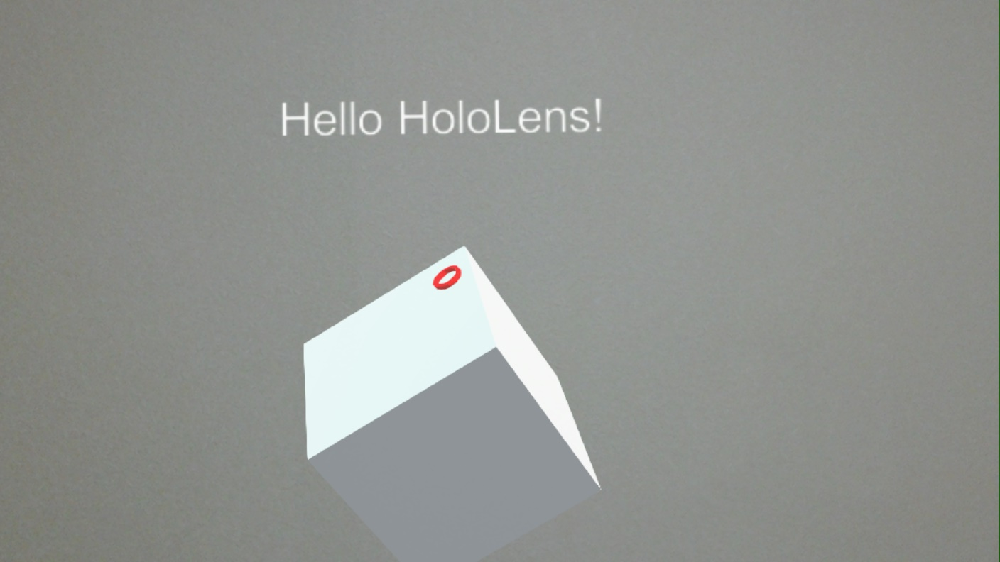